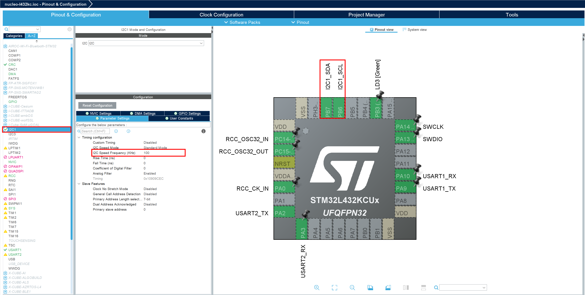
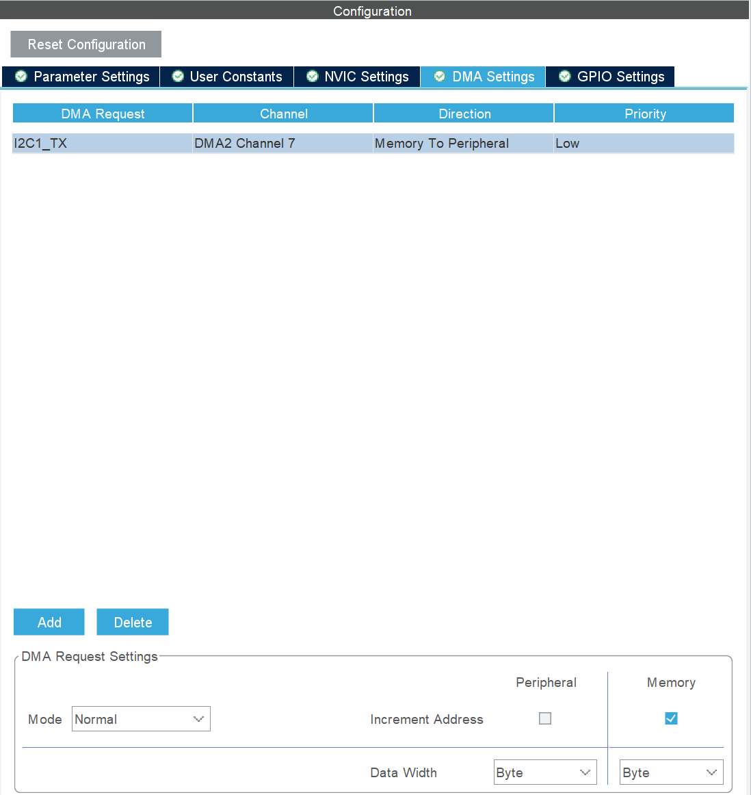
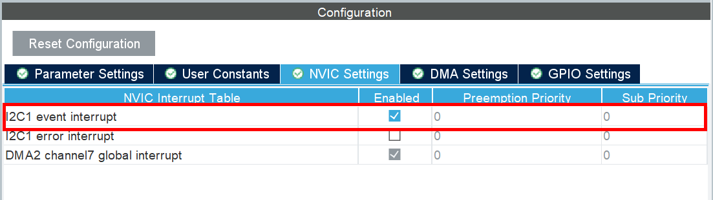
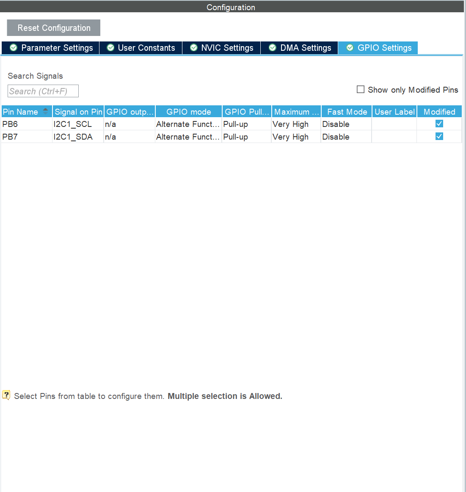

# FRAM FM24W256 for STM32L432

Source implement support write data to FRAM use DMA

## Project configuration

### Parameter settings



### DMA Setting


### NVIC settings



### GPIO Settings

If don't have external pull-up register must set the GPIO for SDA and SCL pin pull-up



## Source code

Source code support for read/write FRAM data with blocking(No DMA) and none-blocking(use DMA) with method `fm24w256_writes_dma`

`fm24w256_writes_dma` must be have configuration in [fm24w256.c](fm24w256.c) must be set for suitable

```c
#define FRAM_WRITE_BUF_SIZE		8		/** Handle 8 requeset at time */
#define FRAM_WRITE_DMA_BUF_SIZE	8		/** Allow to write data each request */
```

### Example

See `int fm24w256_example(void);` in [fm24w256.c](fm24w256.c)

```c
int fm24w256_example(void) {
//	const char data[] = "hello world";
//	if(fm24w256_writes(0, (uint8_t*)data, strlen(data)))
//	{
//		return;
//	}
//	HAL_Delay(100);
//	char buf[128];
//	memset((void*) buf, 0, sizeof(buf));
//	if (fm24w256_reads(0, (uint8_t*) buf, sizeof(data))) {
//		return -1;
//	}

	char buf1[] = "Test 1";
	char buf2[] = "Test 2";
	char buf3[] = "Test 3";
	char buf4[] = "Test 4";
	char buf5[] = "Test 5";
	char buf6[] = "Test 6";
	char buf7[] = "Test 7";
	char buf8[] = "Test 8";

	if (fm24w256_writes_dma(0, (uint8_t*) buf1, sizeof(buf1))) {
		return -1;
	}
	if (fm24w256_writes_dma(16, (uint8_t*) buf2, sizeof(buf2))) {
		return -1;
	}
	if (fm24w256_writes_dma(32, (uint8_t*) buf3, sizeof(buf3))) {
		return -1;
	}
	if (fm24w256_writes_dma(48, (uint8_t*) buf4, sizeof(buf4))) {
		return -1;
	}
	if (fm24w256_writes_dma(64, (uint8_t*) buf5, sizeof(buf5))) {
		return -1;
	}
	if (fm24w256_writes_dma(80, (uint8_t*) buf6, sizeof(buf6))) {
		return -1;
	}
	if (fm24w256_writes_dma(96, (uint8_t*) buf7, sizeof(buf7))) {
		return -1;
	}
	if (fm24w256_writes_dma(112, (uint8_t*) buf8, sizeof(buf8))) {
		return -1;
	}

	HAL_Delay(1000);
	memset(buf1, 0, sizeof(buf1));
	memset(buf2, 0, sizeof(buf2));
	memset(buf3, 0, sizeof(buf3));
	memset(buf4, 0, sizeof(buf4));
	memset(buf5, 0, sizeof(buf5));
	memset(buf6, 0, sizeof(buf6));
	memset(buf7, 0, sizeof(buf7));
	memset(buf8, 0, sizeof(buf8));
	if (fm24w256_reads(0, (uint8_t*) buf1, sizeof(buf1))) {
		return -1;
	}
	if (fm24w256_reads(16, (uint8_t*) buf2, sizeof(buf2))) {
		return -1;
	}
	if (fm24w256_reads(32, (uint8_t*) buf3, sizeof(buf3))) {
		return -1;
	}
	if (fm24w256_reads(48, (uint8_t*) buf4, sizeof(buf4))) {
		return -1;
	}
	if (fm24w256_reads(64, (uint8_t*) buf5, sizeof(buf5))) {
		return -1;
	}
	if (fm24w256_reads(80, (uint8_t*) buf6, sizeof(buf6))) {
		return -1;
	}
	if (fm24w256_reads(96, (uint8_t*) buf7, sizeof(buf7))) {
		return -1;
	}
	if (fm24w256_reads(112, (uint8_t*) buf8, sizeof(buf8))) {
		return -1;
	}
	return 0;
}
```

## Validation data

Call the method `fm24w256_crc` to use hardware crc. This is share with modbus slave. And it's return 16bits data
