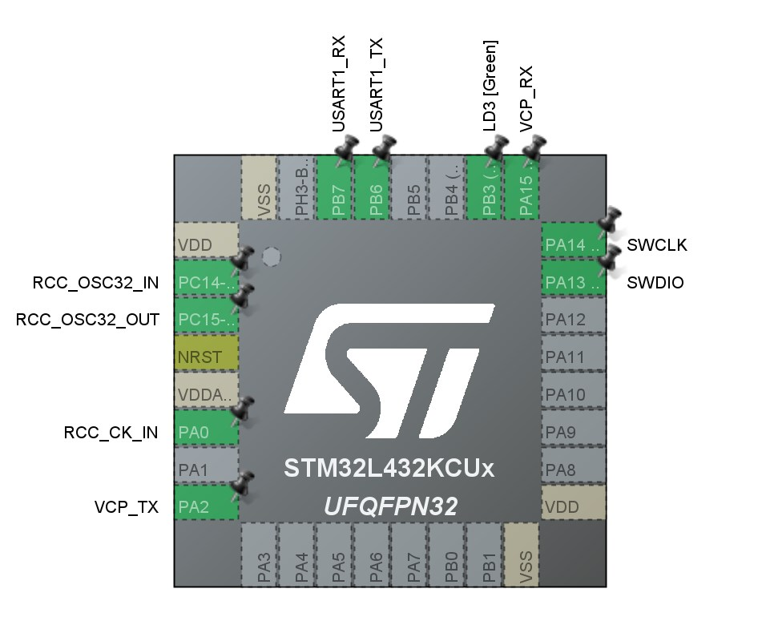
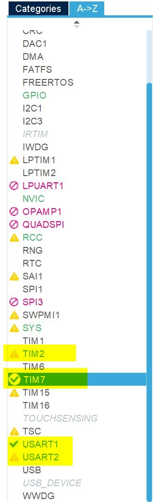

# NUCLEO-L432KC Modbus slave example



## Project configure



| Modbus | Uart | Timer |
|--------|:----:|:-----:|
| Main (Working with L4 Master)   | 1    |   2   |
| HMI | 1 | 7|

Edit the configure on source [lib/bsp_mb_slave.c](lib/bsp_mb_slave.c)

```c
/* type =======================================================*/
typedef enum
{
	BSP_MODBUS_SLAVE_MAIN,	// MODBUS slave will be working with L4 Master
	BSP_MODBUS_SLAVE_HMI,	// MODBUS slave will be working with HMI touch screen
	_BSP_MODBUS_SLAVE_NUM,
}bsp_mb_slave_t;

/* UART and TIMER instance */
#define uart_instance_main	huart1
#define uart_instance_hmi	huart2
#define timer_instance_main	htim2
#define timer_instance_hmi	htim7

/* private variable ===========================================*/
//static mb_slave_t __mb;			// MODBUS slave instance
static mb_data_t  __mb_data;	// MODBUS data
static mb_slave_t __slave[_BSP_MODBUS_SLAVE_NUM];

/* public variable ============================================*/
extern UART_HandleTypeDef uart_instance_main;
extern UART_HandleTypeDef uart_instance_hmi;
extern TIM_HandleTypeDef timer_instance_main;
extern TIM_HandleTypeDef timer_instance_hmi;

void bsp_mb_slave_init(void) {
	__slave[BSP_MODBUS_SLAVE_MAIN].uart  = &uart_instance_main;
	__slave[BSP_MODBUS_SLAVE_HMI].uart   = &uart_instance_hmi;
	__slave[BSP_MODBUS_SLAVE_MAIN].timer = &timer_instance_main;
	__slave[BSP_MODBUS_SLAVE_HMI].timer  = &timer_instance_hmi;

	mb_data_init(&__mb_data);

	mb_slave_init(&__slave[BSP_MODBUS_SLAVE_MAIN], &__mb_data, BSP_MB_SLAVE_ID, BSP_MB_SLAVE_SPEED, BSP_MB_TIMER_CLOCK_SOURCE);
	mb_slave_init(&__slave[BSP_MODBUS_SLAVE_HMI], &__mb_data, BSP_MB_SLAVE_ID, BSP_MB_SLAVE_SPEED, BSP_MB_TIMER_CLOCK_SOURCE);
}
```