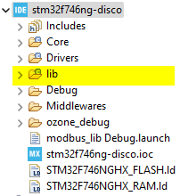

# MODBUS Slave lib for STM32

Lib write follow standard `MODBUS APPLICATION PROTOCOL SPECIFICATION
V1.1b3` publish by [modbus.org](https://modbus.org/). Download [Modbus_Application_Protocol_V1_1b3.pdf](https://modbus.org/docs/Modbus_Application_Protocol_V1_1b3.pdf) or 
[doc](docs/Modbus_Application_Protocol_V1_1b3.pdf)

Lib source path: `source/modbus`

## Configure for STM32 using CubeMX

### 1. Timer
Configure timer clock source and enable global interrupt as bellow:


```
NOTE: If using the internal clock should check clock source from datasheet,
the value will be use configure for modbus lib
```


In this project use timer 3 with clock source from APB1


### 2. UART

Choose UART and enable global interrupt as bellow:


Note: The modbus lib implement the get data using interrupt and ring-buffer 
it has limit of speed over UART to make sure it's working well the limit 
of speed is `115200`

### 3. Copy modbus source from `source/modbus` to your project, like bellow:



Modbus lib use Segger RTT for log. Default it's enabled. 

If don't use this log can disable by edit file: `modbus/mb_log.h` and comment macro `MB_LOG`
```c
#ifdef MB_DEBUG
#define MB_LOG
#endif

#ifdef MB_LOG
#include "SEGGER_RTT.h"
#define mb_log_init()		SEGGER_RTT_ConfigUpBuffer(0, NULL, NULL, 0, SEGGER_RTT_MODE_NO_BLOCK_SKIP)
#define mb_log(_c, ...)		SEGGER_RTT_printf(0, _c, ##__VA_ARGS__);
#else
#define mb_log_init()
#define mb_log()
#endif
```

If keep using the Segger RTT log need to edit include on project configure like bellow:


### 4. Include HAL lib for taraget STM32

Edit file `mb_stm32_include.h`, example project run on STM32F7, if you are using other MCU should edit for suitable
```c
#ifndef MB_STM32_INCLUDE_H_
#define MB_STM32_INCLUDE_H_

#include "stm32f7xx_hal.h"
#include "stm32f7xx_hal_uart.h"
#include "stm32f7xx_hal_tim.h"

#endif /* MB_STM32_INCLUDE_H_ */

```

### 5. Note:

Modbus lib already implement the UART and Timer callback handle on `mb_slave.c`. Do not implement the interrupt callback other place to avoid error while compile

```C
/* STM32 interrupt callback ===================================*/
/**
  * @brief  Period elapsed callback in non-blocking mode
  * @param  htim TIM handle
  * @retval None
  */
void HAL_TIM_PeriodElapsedCallback(TIM_HandleTypeDef *htim)
{
	if (mb_slave && mb_slave->timer == htim) {
		// Stop receive UART
		HAL_UART_AbortReceive_IT(mb_slave->uart);
		HAL_TIM_Base_Stop_IT(mb_slave->timer);

		// Copy data from buffer to MODBUS packet
		if(mb_slave->uart_buf.overflow)
		{
			mb_slave->uart_buf.flush(&mb_slave->uart_buf);
		}
		else
		{
			mb_pdu_t *pdu = mb_slave->buf.next(&mb_slave->buf);
			pdu->len = MB_PDU_SIZE;
			mb_slave->uart_buf.get_data(&mb_slave->uart_buf, pdu->data, &pdu->len);
			mb_slave->buf.commit_next(&mb_slave->buf);
		}

		// Start receive UART
		HAL_UART_Receive_IT(mb_slave->uart, &mb_slave->uart_rx, 1);
	}
}

/**
  * @brief  Rx Transfer completed callback.
  * @param  huart UART handle.
  * @retval None
  */
void HAL_UART_RxCpltCallback(UART_HandleTypeDef *huart)
{
	if(mb_slave && mb_slave->uart == huart)
	{
		mb_slave->uart_buf.add(&mb_slave->uart_buf, mb_slave->uart_rx);

		// Restart timer
		__HAL_TIM_SET_COUNTER(mb_slave->timer, 0);
		HAL_TIM_Base_Start_IT(mb_slave->timer);
		HAL_UART_Receive_IT(huart, &mb_slave->uart_rx, 1);
	}
}

/**
  * @brief Tx Transfer completed callback.
  * @param huart UART handle.
  * @retval None
  */
void HAL_UART_TxCpltCallback(UART_HandleTypeDef *huart)
{
	if(mb_slave && mb_slave->uart == huart)
	{
		tx_buf.tail = (tx_buf.tail + tx_len) % UART_TX_BUF_SIZE;
		start_transmit(mb_slave);
	}
}
```

## Configure modbus lib

### 1. Modbus data register

Edit file `data/mb_data_config.h` to change the limit register of data. Update the value of macro bellow:

```c
#ifndef _MB_DATA_CONFIG_H_
#define _MB_DATA_CONFIG_H_

#define MB_COIL_NUM				32	// number of coil, @note: multiple of 8, @TODO edit
#define MB_INPUT_NUM			32	// number of input, @note: multiple of 8, @TODO edit
#define MB_REG_INPUT_NUM		32	// number of reg input , @TODO edit
#define MB_REG_HOLDING_NUM		32	// number of reg holding, @TODO edit

#endif /* _MB_DATA_CONFIG_H_ */
```

### 2. MODBUS param
Edit the macro value on `bsp_mb_slave.c`. UART speed like value use on `CubeMX` configure
```c
/* macro ======================================================*/
#define BSP_MB_SLAVE_ID				0x01
#define BSP_MB_SLAVE_SPEED			115200	// bps
#define BSP_MB_TIMER_CLOCK_SOURCE	100		// Mhz
```
Edit `timer` and `uart` instance on `bsp_slave.c`
```c
/* public variable ============================================*/
extern UART_HandleTypeDef huart6;
extern TIM_HandleTypeDef htim3;

void bsp_mb_slave_init(void) {
	__mb.uart = &huart6;
	__mb.timer = &htim3;
	mb_slave_init(&__mb, BSP_MB_SLAVE_ID, BSP_MB_SLAVE_SPEED, BSP_MB_TIMER_CLOCK_SOURCE);
}
```

## Note

The lib optimize for high performance working without delay and multiple modbus request handle limit 10 request. The request can increase depend on target of application. It's require more RAM. The limit can edit on file `mb_buffer.h` change value of macro `MB_BUFFER_SIZE`

```c
/* mb_buffer.h */
#define MB_BUFFER_SIZE			10
```

## Example 

Check on `main.c`

Test example, edit the value of register
```c
	// Update coil status
	bsp_mb_coil_set(0, 1);
	bsp_mb_coil_set(0, 0);
	bsp_mb_coil_set(0, 1);
	bsp_mb_coil_set(0, 0);

	// Update input register
	bsp_mb_discrete_input_set(0, 0);
	bsp_mb_discrete_input_set(0, 1);
	bsp_mb_discrete_input_set(0, 0);
	bsp_mb_discrete_input_set(0, 1);

	// Update input register
	bsp_mb_input_reg_set(0, 1);
	bsp_mb_input_reg_set(1, 2);
	bsp_mb_input_reg_set(2, 3);
	bsp_mb_input_reg_set(3, 4);

	// Update holding register
	bsp_mb_holding_reg_set(0, 5);
	bsp_mb_holding_reg_set(1, 6);
	bsp_mb_holding_reg_set(2, 7);
	bsp_mb_holding_reg_set(3, 8);
```

Test on modbus master [modbus poll](https://www.modbustools.com/download.html)


## Modbus register and application usage

Modbus and application work via the register, modbus read/write value to register then application write the value to ouput or update value/status from peripheral


## Tools

1. [qModbus Master](https://sourceforge.net/projects/qmodmaster/), Or [Tools/qModMaster-Win64-exe-0.5.3-beta.zip](tools/qModMaster-Win64-exe-0.5.3-beta.zip)

2. [Modbus poll](https://www.modbustools.com/download.html)
