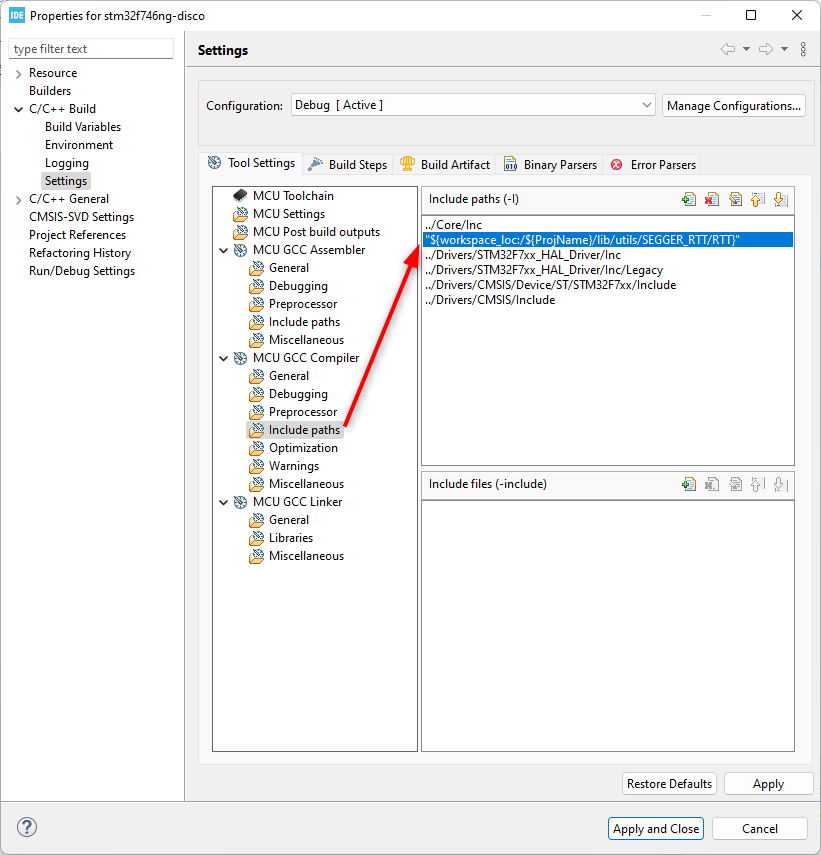

# MODBUS Slave lib for STM32

Lib folder: `source/modbus`

## Configure for STM32Cube project: 

### 1. Timer
Choose the timer that support global interrupt and configure as bellow


```
Timer using internal clock source. Check data sheet to know what is clock source use for target timer. This value also use to configure on modbus lib
```

### 2. UART
Choose UART and enable global interrupt. This modbus lib implement wiht slow speed refer max: 115200 bps. The UART data will be handle as interrupt and ring buffer.


### 3. Copy modbus source from `source/modbus` to your project, like bellow:


Modbus lib use Segger RTT for log. Default it's enabled. If don't use this log can disable by edit file: `modbus/mb_log.h` and comment macro `MB_LOG`
```c
#ifdef MB_DEBUG
#define MB_LOG
#endif

#ifdef MB_LOG
#include "SEGGER_RTT.h"
#define mb_log_init()		SEGGER_RTT_ConfigUpBuffer(0, NULL, NULL, 0, SEGGER_RTT_MODE_NO_BLOCK_SKIP)
#define mb_log(_c, ...)		SEGGER_RTT_printf(0, _c, ##__VA_ARGS__);
#else
#define mb_log_init()
#define mb_log()
#endif
```

If keep using the Segger RTT log need to edit include on project configure like bellow:



### 4. Include hal using for target of STM32 MCU series

Edit file `mb_stm32_include.h`, example project run on STM32F7, if you are using other MCU should edit for suitable
```c
#ifndef MB_STM32_INCLUDE_H_
#define MB_STM32_INCLUDE_H_

#include "stm32f7xx_hal.h"
#include "stm32f7xx_hal_uart.h"
#include "stm32f7xx_hal_tim.h"

#endif /* MB_STM32_INCLUDE_H_ */

```

### 5. Note:

Modbus lib already implement the UART and Timer callback handle on `mb_slave.c`. Do not implement the interrupt callback other place to avoid error while compile

```C
/* STM32 interrupt callback ===================================*/
/**
  * @brief  Period elapsed callback in non-blocking mode
  * @param  htim TIM handle
  * @retval None
  */
void HAL_TIM_PeriodElapsedCallback(TIM_HandleTypeDef *htim)
{
	if (mb_slave && mb_slave->timer == htim) {
		// Stop receive UART
		HAL_UART_AbortReceive_IT(mb_slave->uart);
		HAL_TIM_Base_Stop_IT(mb_slave->timer);

		// Copy data from buffer to MODBUS packet
		if(mb_slave->uart_buf.overflow)
		{
			mb_slave->uart_buf.flush(&mb_slave->uart_buf);
		}
		else
		{
			mb_pdu_t *pdu = mb_slave->buf.next(&mb_slave->buf);
			pdu->len = MB_PDU_SIZE;
			mb_slave->uart_buf.get_data(&mb_slave->uart_buf, pdu->data, &pdu->len);
			mb_slave->buf.commit_next(&mb_slave->buf);
		}

		// Start receive UART
		HAL_UART_Receive_IT(mb_slave->uart, &mb_slave->uart_rx, 1);
	}
}

/**
  * @brief  Rx Transfer completed callback.
  * @param  huart UART handle.
  * @retval None
  */
void HAL_UART_RxCpltCallback(UART_HandleTypeDef *huart)
{
	if(mb_slave && mb_slave->uart == huart)
	{
		mb_slave->uart_buf.add(&mb_slave->uart_buf, mb_slave->uart_rx);

		// Restart timer
		__HAL_TIM_SET_COUNTER(mb_slave->timer, 0);
		HAL_TIM_Base_Start_IT(mb_slave->timer);
		HAL_UART_Receive_IT(huart, &mb_slave->uart_rx, 1);
	}
}

/**
  * @brief Tx Transfer completed callback.
  * @param huart UART handle.
  * @retval None
  */
void HAL_UART_TxCpltCallback(UART_HandleTypeDef *huart)
{
	if(mb_slave && mb_slave->uart == huart)
	{
		tx_buf.tail = (tx_buf.tail + tx_len) % UART_TX_BUF_SIZE;
		start_transmit(mb_slave);
	}
}
```

## Configure modbus lib

### 1. Modbus data register

Edit file `data/mb_data_config.h` to change the limit register of data. Update the value of macro bellow:

```c
#ifndef _MB_DATA_CONFIG_H_
#define _MB_DATA_CONFIG_H_

#define MB_COIL_NUM				32	// number of coil, @note: multiple of 8, @TODO edit
#define MB_INPUT_NUM			32	// number of input, @note: multiple of 8, @TODO edit
#define MB_REG_INPUT_NUM		32	// number of reg input , @TODO edit
#define MB_REG_HOLDING_NUM		32	// number of reg holding, @TODO edit

#endif /* _MB_DATA_CONFIG_H_ */
```

### 2. Change timer clock source
Edit file `mb_config.h` change the macro `MB_TIMER_CLOCK_SOURCE` the value as `Mhz`. In this project timer3 run with clock source `100Mhz`. Check MCU data sheet to change correct value. The value affect to the T3_5 of modbus frame packet detect
```
#ifndef MB_CONFIG_H_
#define MB_CONFIG_H_

/* Number of MODBUS slave instance ============================*/
#define MB_PDU_SIZE				256

/* STM32 timer configure ======================================*/
#define MB_TIMER_32_BIT			0xFFFFFFFF
#define MB_TIMER_16_BIT			0xFFFF

#define MB_TIMER_RESOLUTION		MB_TIMER_16_BIT				// TODO Configure it
#define MB_TIMER_CLOCK_SOURCE	100	// Mhz					// TODO Configure it

/* Debug configure ============================================*/
#define MB_DEBUG

#endif /* MB_CONFIG_H_ */

```

## Note

The lib optimize for high performance working without delay and multiple modbus request handle limit 10 request. The request can increate depend on target of application. It's require more RAM. The limit can edit on file `mb_buffer.h` change value of macro `MB_BUFFER_SIZE`

```c
/* mb_buffer.h */
#define MB_BUFFER_SIZE			10
```

## Example 

Check on `main.c`
